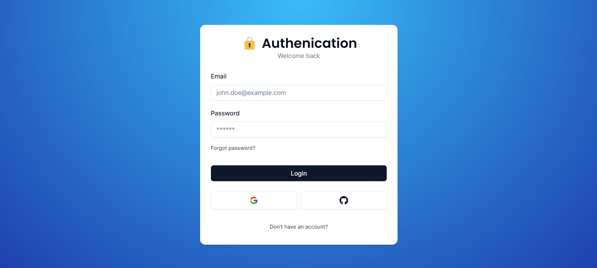
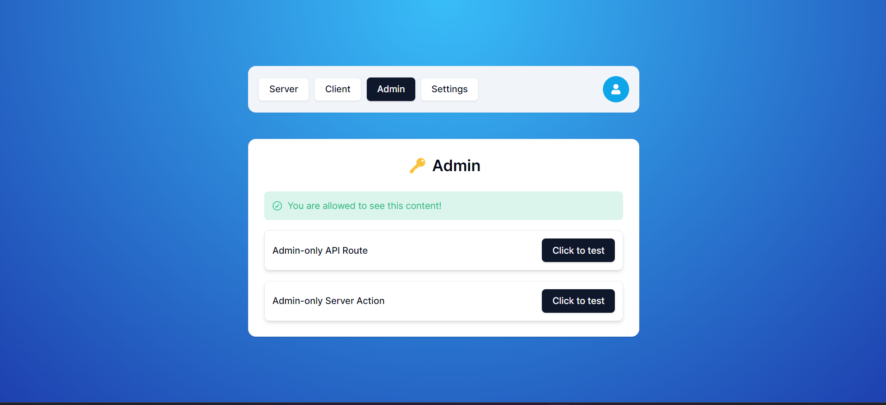
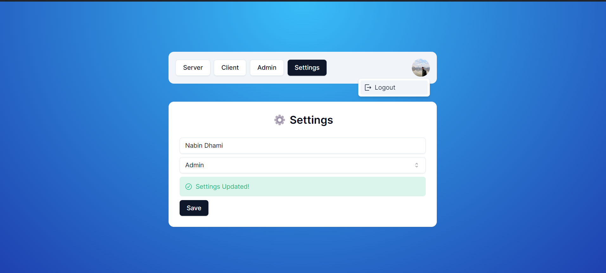

# [Authjs](https://authjs.dev/)





## Key Features

- **🔐 Next-auth v5 (Auth.js):** Utilize the latest version of Next-auth for seamless and secure authentication.

- **🚀 Next.js 14 with Server Actions:** Leverage the power of Next.js 14, enhanced with server actions for optimal performance.

- **🔑 Credentials Provider:** Enable traditional username and password login for your users.

- **🌐 OAuth Provider (Social Login with Google & GitHub):** Implement OAuth authentication, allowing users to sign in with their Google or GitHub accounts.

- **🔒 Forgot Password Functionality:** Provide users with the ability to reset their passwords through a secure process.

- **✉️ Email Verification:** Enhance account security with email verification during the registration process.

- **📱 Two-Factor Verification:** Implement an extra layer of security with two-factor authentication.

- **👥 User Roles (Admin & User):** Define distinct roles for users, including admin and regular user roles.

## Components and Utilities

- **🔓 Login Component (Opens in Redirect or Modal):** Customize the login experience with a flexible and user-friendly component.

- **📝 Register Component:** Seamlessly integrate user registration with a dedicated component.

- **🤔 Forgot Password Component:** Implement a straightforward component for users to recover forgotten passwords.

- **✅ Verification Component:** Display a verification component to confirm user actions.

- **⚠️ Error Component:** Handle errors gracefully with a designated component.

- **🔘 Login Button:** Enhance user interaction with a stylish and functional login button.

- **🚪 Logout Button:** Provide users with an intuitive way to log out of their accounts.

- **🚧 Role Gate:** Implement role-based access control to restrict access based on user roles.

## Advanced Functionality

- **🔍 Exploring Next.js Middleware:** Dive into Next.js middleware to enhance and customize your application's behavior.

- **📈 Extending & Exploring Next-auth Session:** Extend the capabilities of Next-auth sessions for a tailored user experience.

- **🔄 Exploring Next-auth Callbacks:** Explore and customize callbacks in the authentication process.

- **👤 useCurrentUser Hook:** Simplify user data retrieval with the useCurrentUser hook.

- **🛂 useRole Hook:** Streamline role-based access control with the useRole hook.

- **🧑 currentUser Utility:** Access user information effortlessly with the currentUser utility.

- **👮 currentRole Utility:** Retrieve the current user's role with ease using the currentRole utility.

## Examples and Integration

- **🖥️ Example with Server Component:** Gain insights into server-side rendering with a comprehensive example.

- **💻 Example with Client Component:** Explore client-side rendering with a detailed example.

- **👑 Render Content for Admins using RoleGate Component:** Showcase how to display specific content for admins using the RoleGate component.

## Security Measures

- **🛡️ Protect API Routes for Admins Only:** Safeguard API routes by restricting access to admins only.

- **🔐 Protect Server Actions for Admins Only:** Ensure that critical server actions are accessible exclusively to admins.

## User Account Management

- **📧 Change Email with New Verification in Settings Page:** Allow users to update their email addresses securely with a new verification process.

- **🔑 Change Password with Old Password Confirmation in Settings Page:** Provide a straightforward method for users to change their passwords securely.

- **🔔 Enable/Disable Two-Factor Auth in Settings Page:** Grant users control over two-factor authentication settings for added security.

- **🔄 Change User Role in Settings Page (For Development Purposes Only):** Enable role changes for users during development for testing and debugging purposes.

---

> [Edge compatibility](https://authjs.dev/guides/upgrade-to-v5?authentication-method=middleware)
> while `NextAuth.js` strictly uses standard Web APIs (and thus can run in any environments that supports that), some `libraries/ORM` packages that you rely on might not be ready yet. In this case, you can split the auth configuration into multiple files.

> [Upgrading V5](https://authjs.dev/guides/upgrade-to-v5?authentication-method=middleware#new-features)

## [Callbacks](https://authjs.dev/guides/basics/callbacks#:~:text=Callbacks%201%20Sign%20in%20callback%20Use%20the%20signIn,3%20JWT%20callback%20...%204%20Session%20callback%20)

Callbacks are asynchronous functions you can use to control what happens when an action is performed. Callbacks are extremely powerful, especially in scenarios involving JSON Web Tokens as they allow you to implement access controls without a database and to integrate with external databases or APIs.

```ts
  callbacks: {
    async signIn({ user, account, profile, email, credentials }) {
      return true
    },
    async redirect({ url, baseUrl }) {
      return baseUrl
    },
    async session({ session, user, token }) {
      return session
    },
    async jwt({ token, user, account, profile, isNewUser }) {
      return token
    }
  }
```

> If you want to pass data such as an Access Token or User ID to the browser when using JSON Web Tokens, you can persist the data in the token when the jwt callback is called, then pass the data through to the browser in the session callback
